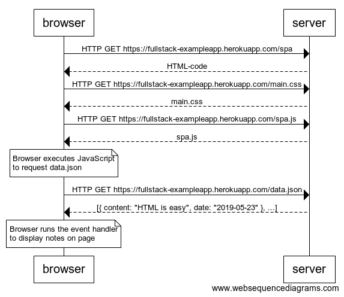

# Full Stack Open

## Part 0 - Fundamentals of Web-apps

### 0.4: new note



```
browser->server: HTTP GET https://fullstack-exampleapp.herokuapp.com/spa
server-->browser: HTML-code
browser->server: HTTP GET https://fullstack-exampleapp.herokuapp.com/main.css
server-->browser: main.css
browser->server: HTTP GET https://fullstack-exampleapp.herokuapp.com/spa.js
server-->browser: spa.js

note over browser:
Browser executes JavaScript
to request data.json
end note

browser->server: HTTP GET https://fullstack-exampleapp.herokuapp.com/data.json
server-->browser: [{ content: "HTML is easy", date: "2019-05-23" }, ...]

note over browser:
Browser runs the event handler
to display notes on page
end note
```
