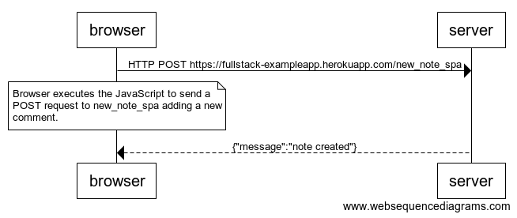

# Full Stack Open

## Part 0 - Fundamentals of Web-apps

### 0.4: new note



```
browser->server: HTTP POST https://fullstack-exampleapp.herokuapp.com/new_note_spa

note over browser:
Browser executes the JavaScript to send a
POST request to new_note_spa adding a new
comment.
end note

server-->browser: {"message":"note created"}
```
